# CIS 5660 HW04 Procedural Buildings

|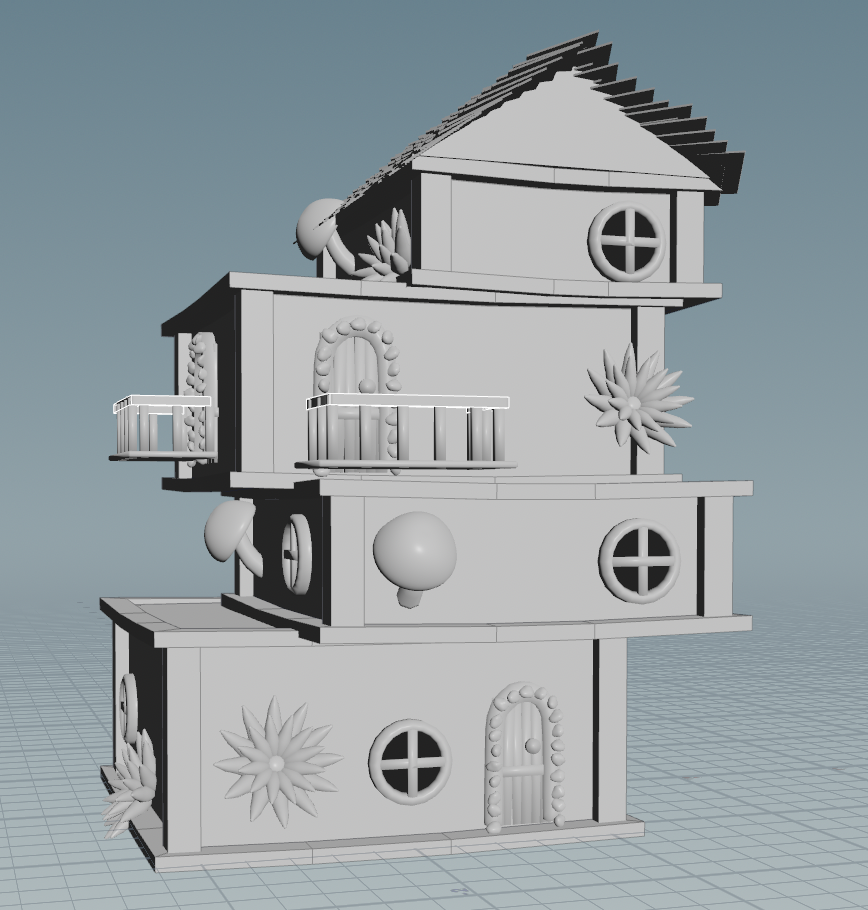|
|:--:|

In this project I'll use Houdini to try and procedurally generate faerie houses! Here are some references I've been inspired by:

<table>
  <tr>
    <td align="center">
      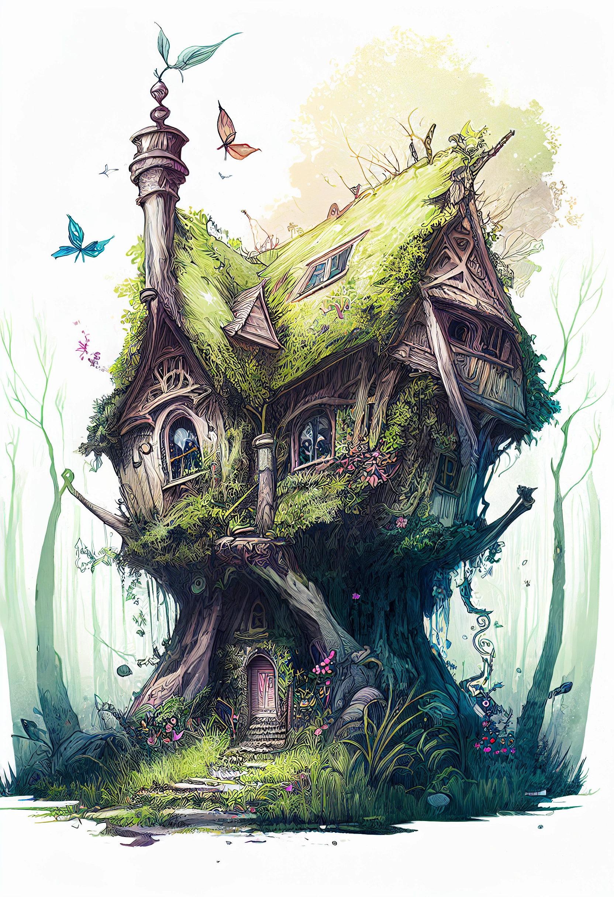 
      <a href="https://www.google.com/imgres?q=fantasy%20faerie%20houses&imgurl=https%3A%2F%2Fcdn.promptden.com%2Fimages%2F3722e98e-cd0f-492f-9d20-bf901e39632a.webp&imgrefurl=https%3A%2F%2Fpromptden.com%2Fpost%2Ffantasy-fairy-house-overgrown-illustration&docid=fq4wl2HDQ7RtTM&tbnid=ktoUGXC3ceSGkM&vet=12ahUKEwi4_IHXrqeQAxV_EFkFHWkkLhk4ChAzegQIRRAA..i&w=1664&h=2432&hcb=2&ved=2ahUKEwi4_IHXrqeQAxV_EFkFHWkkLhk4ChAzegQIRRAA">[1]</a>
    </td>
    <td align="center">
      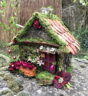 
      <a href="https://www.fairiesoftranquility.com/en-us/products/magical-fairy-house">[2]</a>
    </td>
    <td align="center">
      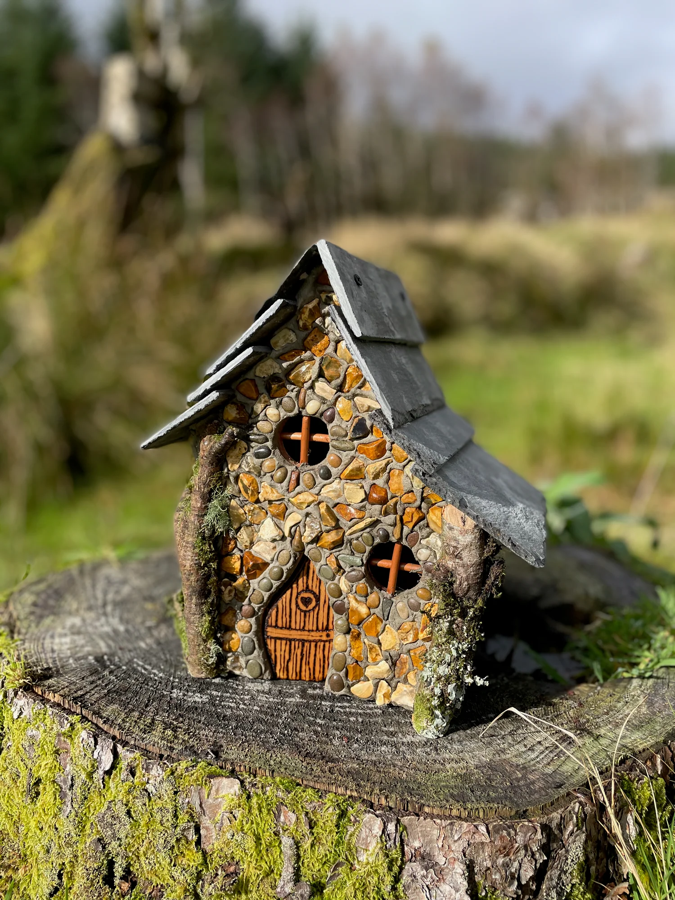 
      <a href="https://irishfaeriehouses.myshopify.com/">[3]</a>
    </td>
  </tr>
  <tr>
    <td align="center">
      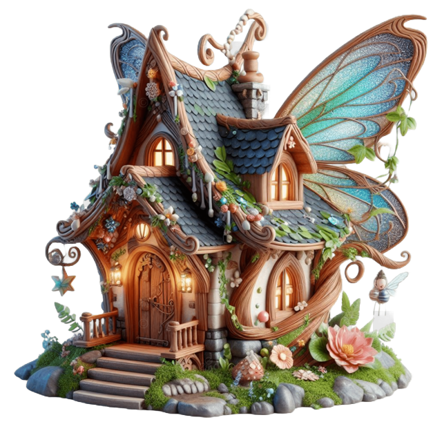 
      <a href="https://pngtree.com/freepng/enchanted-fairy-house-whimsical-tree-dwelling_15424690.html">[4]</a>
    </td>
    <td align="center">
      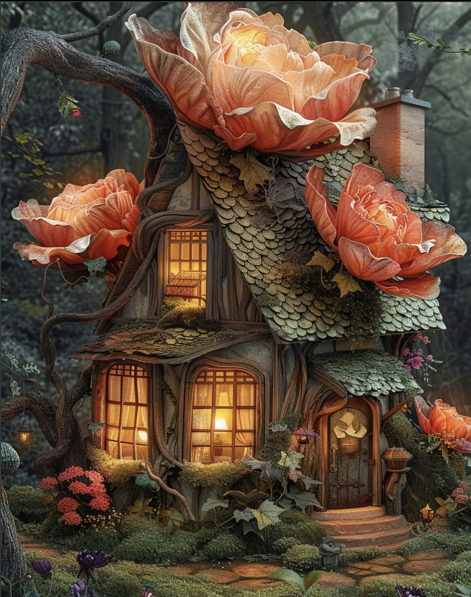 
      <a href="https://www.instagram.com/p/C7ibh60tUsi/?img_index=1">[5]</a>
    </td>
    <td align="center">
      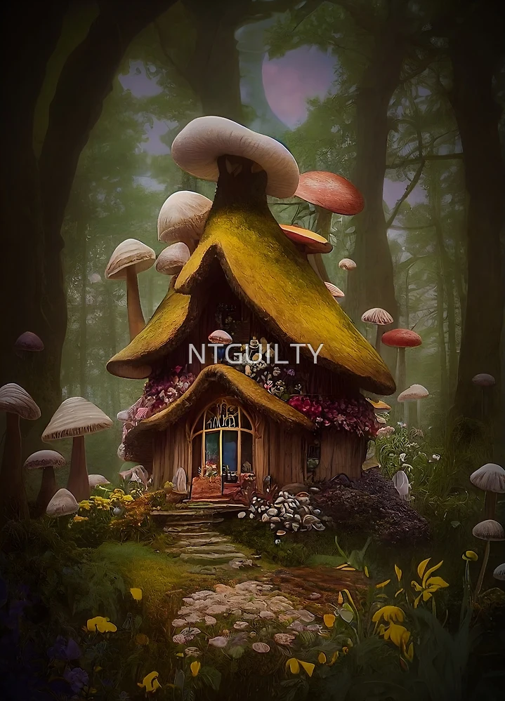 
      <a href="https://www.redbubble.com/i/photographic-print/Fantasy-Fairy-Mushroom-House-Art-by-NTGUILTY/131760133.6Q0TX">[6]</a>
    </td>
  </tr>
</table>

These images are what inspired most of the assets I created in Houdini to place around my house. For base architectural assets I created sytylized doors, windows, and balconies.

|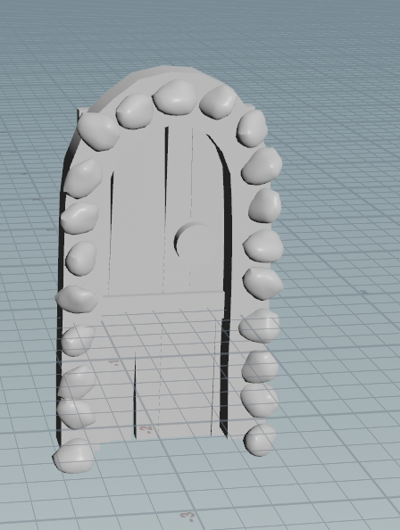|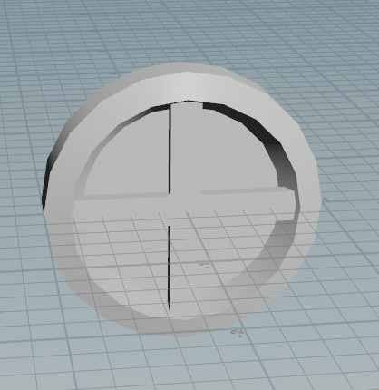|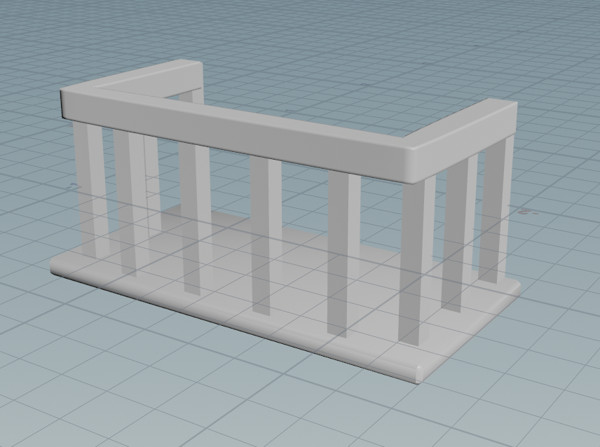|
|:--:|:--:|:--:|

And to better fit the theme of the houses I also created flowers and mushrooms.

|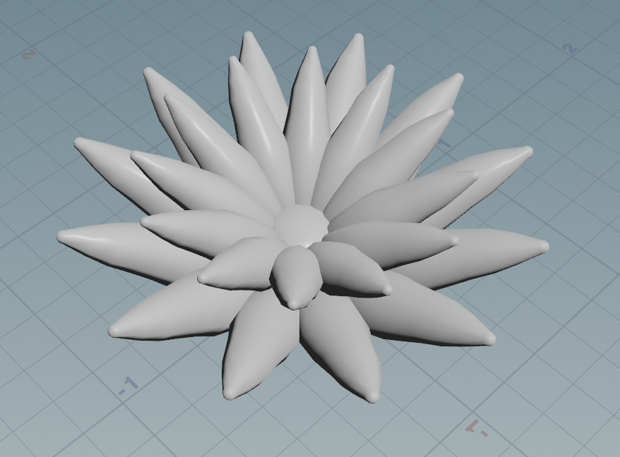|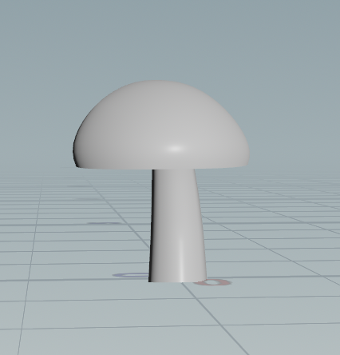|
|:--:|:--:|

I also added pillars and borders to each floor of the house, supports underneath floors if they went past the edge of their lower floor by too much, and a roof for the top of the house.

|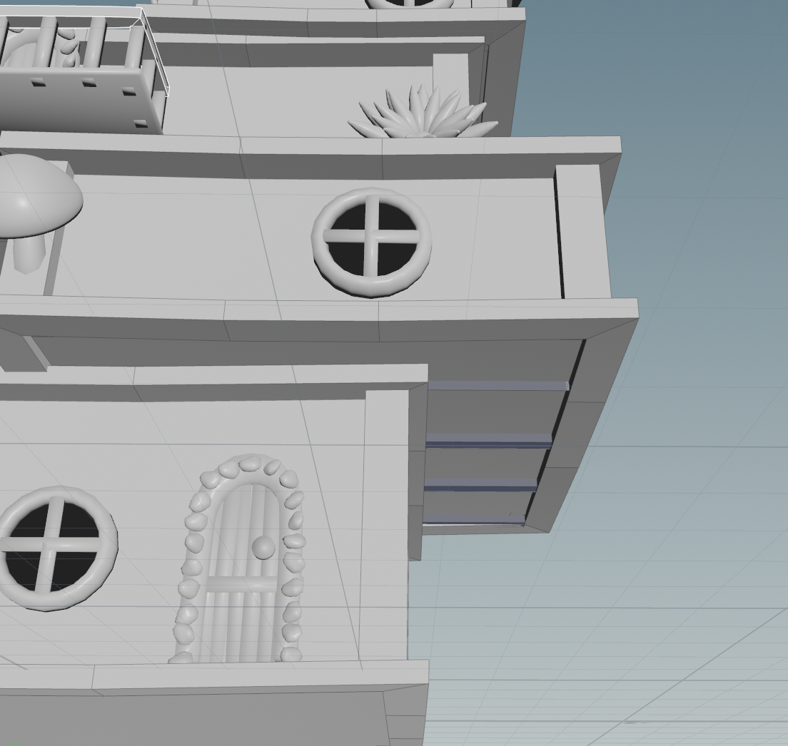||
|:--:|:--:|

Here's a demo video of the tool in action:

<video src="img/demo.mp4" width="800" muted playsinline></video>